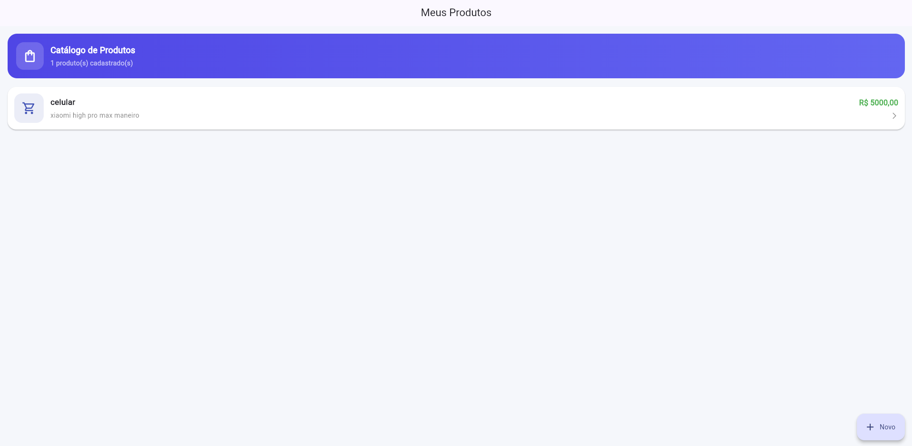
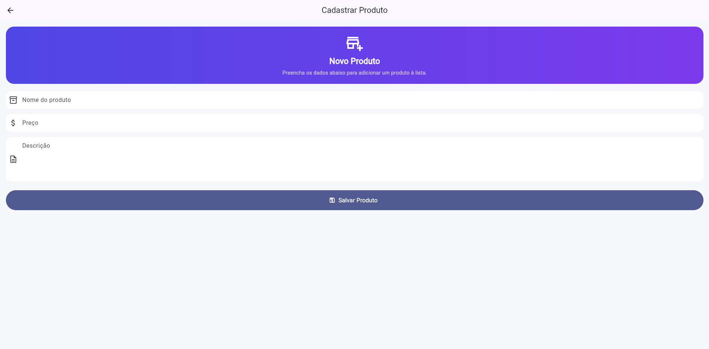
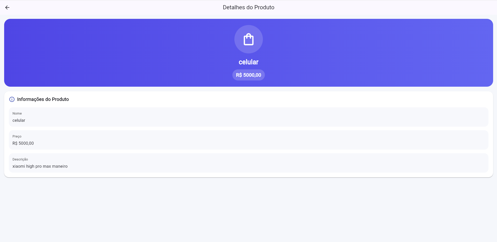

# App de Produtos Flutter

## Aluno

Felipe Fernando Corrêa

## Turma

ADS 5ª fase

## Disciplina

Desenvolvimento para dispositivos mobile

## Descrição do Projeto

Este projeto foi desenvolvido em Flutter e tem como objetivo realizar o cadastro e a visualização de produtos.

O aplicativo possui 3 telas principais:

* Lista de Produtos
* Cadastro de Produto
* Detalhes do Produto

## Funcionalidades

* Exibir lista de produtos cadastrados
* Cadastrar novo produto
* Validar campos obrigatórios no cadastro
* Retornar o produto cadastrado para a tela principal
* Visualizar detalhes do produto
* Navegar entre telas com `Navigator.push()` e `Navigator.pop()`

## Estrutura do Projeto

```text
lib/
├── main.dart
├── models/
│   └── produto.dart
└── screens/
    ├── lista_produtos.dart
    ├── cadastro_produto.dart
    └── detalhe_produto.dart
```

## Fluxo de Navegação

O fluxo do aplicativo funciona da seguinte forma:

1. O usuário abre o app e visualiza a tela de lista de produtos.
2. Caso não existam produtos cadastrados, uma mensagem é exibida.
3. Ao clicar no botão **+ / Novo**, o usuário é levado para a tela de cadastro.
4. Após preencher os dados e salvar, o produto é retornado para a tela principal.
5. O produto aparece na lista.
6. Ao tocar em um produto da lista, o usuário é direcionado para a tela de detalhes.
7. Na tela de detalhes, são exibidos nome, preço e descrição do produto.

## Tecnologias Utilizadas

* Flutter
* Dart
* Material Design / Material 3

## Como Executar o Projeto

### Pré-requisitos

* Flutter instalado
* Dart instalado
* VS Code ou Android Studio
* Emulador Android, Chrome ou dispositivo físico

### Passos para execução

```bash
git clone https://github.com/FelipeFernando04/app-produtos-flutter-felipe-fernando.git
cd app-produtos-flutter-felipe-fernando
flutter create .
flutter pub get
flutter run
```

## Screenshots

### Tela 1 - Lista de Produtos



### Tela 2 - Cadastro de Produto



### Tela 3 - Detalhes do Produto



## Observações

Este projeto foi desenvolvido conforme os requisitos da atividade, utilizando separação em arquivos, navegação entre telas e passagem de dados entre as páginas.

## Repositório

GitHub:
https://github.com/FelipeFernando04/app-produtos-flutter-felipe-fernando
